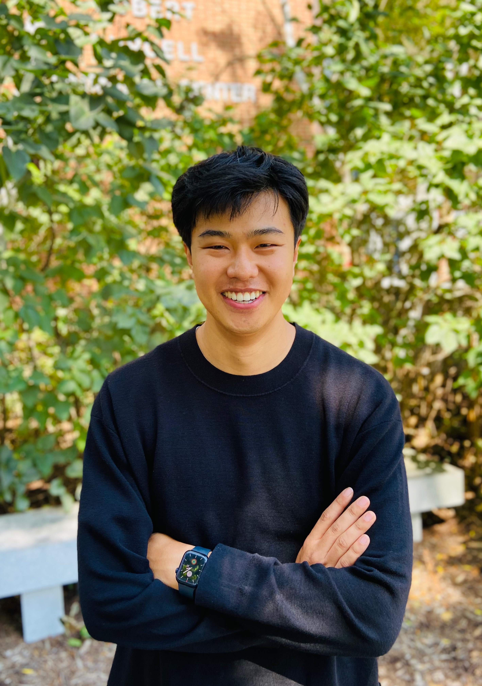

Welcome! I am currently the Frank H. T. Rhodes Postdoctoral Fellow at the Cornell Population Center, Cornell University, with [Matthew Hall](https://publicpolicy.cornell.edu/people/matthew-hall/) as my mentor. I earned my Ph.D. in sociology from Johns Hopkins University in May 2023, under the guidance of [Stephen L. Morgan](https://http://socweb.soc.jhu.edu/faculty/morgan/). I study topics in social stratification, demography, public opinion, immigration, race/ethnicity, and sociology of education, with a methodological specialization in causal inference and demographic methods.  
   
My work has appeared in *Social Science Research*, *Sociological Methods and Research*, *Sociological Science*, and *Socius*. To learn more about my research and teaching experiences, you can find my [CV](/cv_jiwon_lee.pdf), list of [publications](https://jiwonlee.net/research/), [Google Scholar](https://scholar.google.com/citations?user=nszIX_sAAAAJ&hl=en) profile, and [teaching experiences](https://jiwonlee.net/teaching/).
 
 
 

#### Contact
<jiwon.lee@cornell.edu>   
3M230 Martha Van Rensselaer Hall, Ithaca NY 14853 
